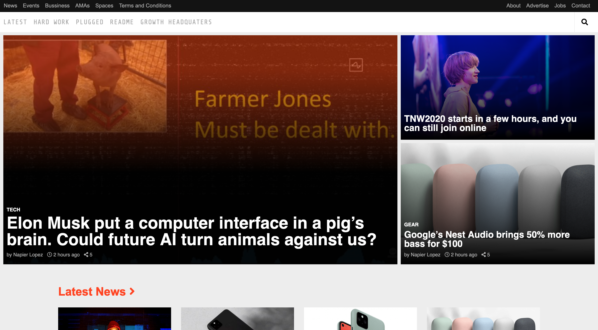

# The Next Web Clone

> Clone of The NextWeb webpage with responsive layout

This project is the sixth one in the HTML/CSS module at Microverse. Main goal was to build responsive web page. We cloned The Next Web.

We worked on all the requirements given on this project.

Aligned all elements with float and flex or grid.
Used semantic HTML elements for the header, the main content and the footer.
We styled the elements to look like the real webpage.
We used some CSS positioning techniques like Flexbox and Grid.
## Built With

- HTML5
- CSS3

## Live Demo

[Live Demo Link](https://raw.githack.com/zdrale/Responsive-Web-Page/master/index.html)

## Authors

👤 **CY Kalu**

- GitHub: [@cyonii ](https://github.com/cyonii )
- Twitter: [@theOnuoha](https://twitter.com/theOnuoha)
- LinkedIn: [@silas-kalu](https://www.linkedin.com/in/silas-kalu-2a9a13199/ )

👤 **Nikola Zdrale**

- GitHub: [@zdrale](https://github.com/zdrale)
- Twitter: [@zdralenikola](https://twitter.com/zdralenikola)
- LinkedIn: [@nikola-zdrale](https://www.linkedin.com/in/nikola-zdrale/)

## 🤝 Contributing

Contributions, issues, and feature requests are welcome!
